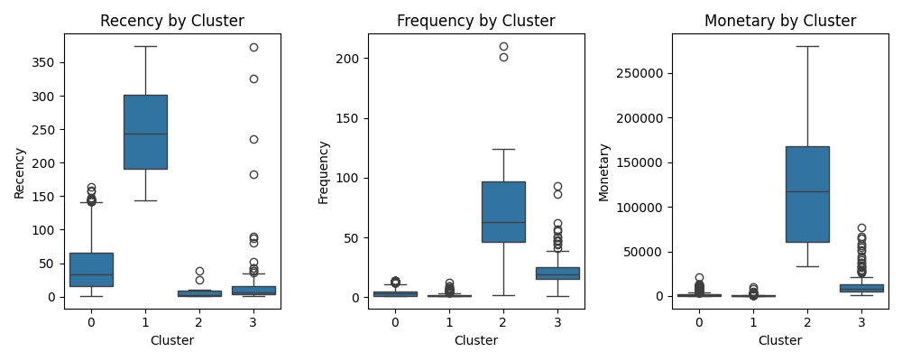

# Project Public Store
🎯💥

This project simulates a real-word sales analysis for **Public**, a major Greek retail chain, using real-word data from the [Online Retail II dataset](https://www.kaggle.com/datasets). The goal is to demonstrate end-to-end data analytics skills using **Python (via PyCharm)** for data preperation and **Power BI** for business-oriented visual insights.  

---

## 📑 Table of Contents

- [Project Overview](#project-overview)
- [Tech Stack](#tech-stack)
- [Data Preparation](#data-preparation)
  - [Data Source](#data-source)
- [Python Data Cleaning Process](#data-cleaning)
- [RFM & K-MEANS analysis](#rfm-k-means-analysis)
- [Analyse the Data](#analyse-the-data)
- [Sales & RFM Dashboard](#sales-rfm-dashboard)
- [Interactivity & Filters](#interactivity--filters)
- [Screenshots](#screenshots)
- [Recommendations](#Recommendations)
- [How to Use](#how-to-use)
- [Project Outcome](#project-outcome)
- [Author](#author)

---

## 🔍 Project Overview

**Objective:**  
Simulate a real-world retail analytics scenario using historical sales data that reflects actual transactions from Public, and deliver a business-ready dashboard focused on deriving actionable insights that support product performance monitoring and customer segmentation. This includes:

- 📊 Understand and clean the sales data
- 💰 Identify key trends in product performance and customer behavior
- 🛒 Segment the customer base using RFM analysis  
- 🧑‍🤝‍🧑 Design a compelling Power BI dashboard to communicate business insights
- 📍 Customer ID & Country Filters  

---

## 🛠 Tech Stack
 
- **Python (via PyCharm)** – Data cleaning & analyze the trends with libraries like pandas, datetime, re, sklearn, matplotlib and seaborn
- **Power BI** – Interactive visual dashboards  
- **GitHub** – Version control & collaboration  

---

## 🧹 Data Preparation

### 📁 Data Source
[View the data UCI Online Retail II Data Set](https://www.kaggle.com/datasets/jillwang87/online-retail-ii)

---

## Python Data Cleaning Process

> **Cleaned and structured using Python in PyCharm.**  
> ✅ Data import and explore the data with pandas library

```python
import pandas as pd
import re
import datetime
# DATA IMPORT FROM CSV 
df = pd.read_csv(r"C:\Users\chris\OneDrive\Desktop\ΧΡΗΣΤΟΣ\PUBLIC PROJECT\data.csv\.vscode\DataCleaningPython\data.csv",encoding='windows-1252')
print(df)
#FIRST 5 ROWS
print(f'{df.head()}\n')
#SHAPE
print(f'{df.shape}\n')
#COLUMN TYPES
print(f'{df.info()}\n')
#COLUMN NAMES
print(f'{df.columns}\n') 
#STATISTICAL INFO
print(f'{df.describe()}\n')
```

> ✅ Drop na's and modify the incoicedate column type

```python
#DATA CLEANING
##HOW MANY NULLS IN COLUMNS AND DROP THEM
df.isna().sum()
df[['Description', 'CustomerID']]
df.dropna(subset=['Description'], inplace=True)
df.dropna(subset=['CustomerID'], inplace=True)

##MODIFY COLUMN INVOICEDATE DATA TYPE
df['InvoiceDate'].info()
df['InvoiceDate'] = pd.to_datetime(df['InvoiceDate'])
```

> ✅ Create two tables for earnings and returns and create a column TotalPrice for all the tables

```python
##CREATE 2 TABLES ONE FOR EARNINGS AND ONE FOR RETURNS
df_earnings = df[df['Quantity'] > 0]
df_returns = df[df['Quantity'] < 0]
df_earnings.head()
df_returns.head()

##CREATE NEW COLUMN TOTAL PRICE FOR BOTH TABLES
df_earnings['TotalPrice'] = df_earnings['Quantity'] * df_earnings['UnitPrice']
df_returns['TotalPrice'] = df_returns['Quantity'] * df_returns['UnitPrice']
df['TotalPrice'] = df['Quantity'] * df['UnitPrice']
df_earnings.head()
df_returns.head()
df.head()
```

> ✅ Normalize the data

```python
##NORMALIZE THE DATA IN COLUMNS 
df['Description'].apply(lambda x: re.sub(r'[!@#$%^&.,]', '', str(x)))
df['Description']
df_earnings['Description'].apply(lambda x: re.sub(r'[!@#$%^&.,]', '', str(x)))
df_earnings['Description']
df_returns['Description'].apply(lambda x: re.sub(r'[!@#$%^&.,]', '', str(x)))
df_returns['Description']
```

> ✅ Drop duplicates

```python
df.duplicated().value_counts()

##Remove Duplicates
df.drop_duplicates(subset=['InvoiceNo', 'StockCode', 'Description', 'Quantity', 'InvoiceDate','UnitPrice', 'CustomerID', 'Country'], inplace=True, ignore_index=True)
df_earnings.drop_duplicates(subset=['InvoiceNo', 'StockCode', 'Description', 'Quantity', 'InvoiceDate','UnitPrice', 'CustomerID', 'Country'], inplace=True, ignore_index=True)
df_returns.drop_duplicates(subset=['InvoiceNo', 'StockCode', 'Description', 'Quantity', 'InvoiceDate','UnitPrice', 'CustomerID', 'Country'], inplace=True, ignore_index=True)
df.info()
df_earnings.info()
df_returns.info()
```

> ✅ Export the data

```python
#EXPORT THE DATA 
df.to_csv('PublicProjectCleaned.csv')
df_earnings.to_csv('PublicProjectSales.csv')
df_returns.to_csv('PublicProjectReturns.csv')
```

---

## RFM & K-MEANS ANALYSIS

> ✅ Create RFM table

```python
import pandas as pd
import datetime
import matplotlib.pyplot as plt
import seaborn as sns
#RFM
reference_date = dt.datetime(2011, 12, 11)
rfm = df_earnings.groupby('CustomerID').agg({'InvoiceDate': lambda x: (reference_date - x.max()).days,
                                             'InvoiceNo': 'nunique',
                                             'TotalPrice': 'sum'})
rfm.columns = ['Recency', 'Frequency', 'Monetary']
print(rfm.reset_index())
```

> ✅ Standarize the data and k-means clustering with elbow method

```python
from sklearn.preprocessing import StandardScaler
from sklearn.cluster import KMeans
#KMeans
scaler = StandardScaler()
rfm_scaled = scaler.fit_transform(rfm[['Recency', 'Frequency', 'Monetary']])
print(rfm_scaled)

inertias = []
for i in range(1, 11):
    kmeans = KMeans(n_clusters=i, random_state=42)
    kmeans.fit(rfm_scaled)
    inertias.append(kmeans.inertia_)
print(inertias)
print(rfm)

plt.figure(figsize=(12, 6))
plt.plot(range(1,11), inertias, 'o-')
plt.xlabel('Number of Clusters')
plt.ylabel('Inertia')
plt.title('Elbow Method')
plt.grid(True)
plt.show()

kmeans = KMeans(n_clusters=4, random_state=42)
rfm['Cluster'] = kmeans.fit_predict(rfm_scaled)
```
-- The script result is: --

##### As you can see the image in 4 we have the elbow effect and this is the reason i choose the number 4 as the number of clusters

> ✅ Boxplot & Scatterplots

```python
#Plots
plt.figure(figsize=(10,4))
for i, column in enumerate(['Recency', 'Frequency', 'Monetary']):
    plt.subplot(1, 3, i+1)
    sns.boxplot(x='Cluster', y=column, data=rfm)
    plt.title(f'{column} by Cluster')
plt.tight_layout()
plt.show()

rfm = rfm.reset_index()
plt.figure(figsize=(12,6))
for i, column in enumerate(['Recency', 'Frequency', 'Monetary']):
    plt.subplot(1, 3, i+1)
    sns.scatterplot(x= 'Cluster', y= column, data=rfm, hue='Cluster', palette='pastel')
plt.tight_layout()
plt.show()

rfm = rfm.reset_index()
plt.figure(figsize=(12,6))
for i, column in enumerate(['Recency', 'Frequency', 'Monetary']):
    plt.subplot(1, 3, i+1)
    sns.scatterplot(x= 'CustomerID', y= column, data=rfm, hue='Cluster', palette='pastel')
plt.tight_layout()
plt.show()
#Export the RFM table
rfm.to_csv("RFM.csv", index=False)
```
--- The script results are: ---
| Boxplot | Scatterplot by Clusters | Scatterlot by Customer ID |
|  |  | 
##### From all the images you can explore how the k-means performs with 4 clusters!!!

## Analyze the data 

> ✅ Top 10 items Returned

```python
df_returns.head()
top_returns = ( 
    df_returns.groupby(['StockCode', 'Description']).agg(ReturnCount = ('InvoiceNo', 'count'), 
                                                                   TotalReturned = ('Quantity', lambda x: abs(x).sum()), 
                                                                   ValueReturned = ('TotalPrice', lambda x: abs(x).sum())
    )
    .sort_values('TotalReturned', ascending = False)
    .reset_index()
)
top_returns.head(10)
```
--- The Top 10 Returns are: ---
| Rank | StockCode | Description                         | ReturnCount | TotalReturned | ValueReturned |
|------|-----------|-------------------------------------|-------------|---------------|---------------|
| 1    | 23843     | "PAPER CRAFT , LITTLE BIRDIE"       | 1           | 80995         | 168469.60     |
| 2    | 23166     | MEDIUM CERAMIC TOP STORAGE JAR      | 10          | 74494         | 77479.64      |
| 3    | 84347     | ROTATING SILVER ANGELS T-LIGHT HLDR | 3           | 9367          | 298.65        |
| 4    | M         | Manual                              | 175         | 3995          | 112165.39     |
| 5    | 21108     | FAIRY CAKE FLANNEL ASSORTED COLOUR  | 3           | 3150          | 6591.42       |
| 6    | 85123A    | WHITE HANGING HEART T-LIGHT HOLDER  | 42          | 2578          | 6624.30       |
| 7    | 21175     | GIN + TONIC DIET METAL SIGN         | 7           | 2030          | 3775.33       |
| 8    | 22920     | HERB MARKER BASIL                   | 2           | 1527          | 841.05        |
| 9    | 22273     | FELTCRAFT DOLL MOLLY                | 6           | 1447          | 3512.65       |
| 10   | 47566B    | TEA TIME PARTY BUNTING              | 7           | 1424          | 3692.95       |
### INSIGHTS
##### As you can see the product with the most returns 80995 pieces is the "PAPER CRAFT , LITTLE BIRDIE" with value 168469.60 euros. So the company should check this product and see why it has so many returns!


> ✅ Monthly Sales

```python
#SALES BY MONTH
##CREATE MONTH, YEAR COLUMNS
df_earnings.head()
df['InvoiceDate'].info()
df_earnings_copy = df_earnings.copy()
df_earnings_copy.head()
df_earnings_copy['Month'] = df_earnings_copy['InvoiceDate'].dt.month
df_earnings_copy['Year'] = df_earnings_copy['InvoiceDate'].dt.year
df_earnings_copy.head()
##CHECK IF WE HAVE THE WRIGHT COLUMNS 
df_earnings_copy[df_earnings_copy['Month'].isin([9, 10])]
df_earnings_copy['Month'].value_counts()
df_earnings_copy['Year'].value_counts()
##CREATE COLUMN MONTHNAME WITH THE NAME OF MONTH
df_earnings_copy['MonthName'] = df_earnings_copy['InvoiceDate'].apply(lambda x: x.strftime('%B'))
df_earnings_copy.head()
df_earnings_copy['MonthName'].value_counts()
##CREATE TABLE SALES BY MONTH
monthly_sales = ( 
    df_earnings_copy.groupby('MonthName')['TotalPrice'].sum().reset_index()

)
##SORT MONTHLY SALES
monthly_sales_sorted = monthly_sales.sort_values('TotalPrice', ascending=False).reset_index()
del monthly_sales_sorted['index']
monthly_sales_sorted
##CREATE A BAR CHART
import matplotlib.pyplot as plt
plt.style.available
plt.style.use('ggplot')
plt.figure(figsize=(12,6))
plt.bar(monthly_sales_sorted['MonthName'], monthly_sales_sorted['TotalPrice'].round(2), color='Skyblue')
plt.title('SALES BY MONTH')
plt.xlabel('MONTH')
plt.ylabel('SALES')
plt.xticks(monthly_sales_sorted['MonthName'], rotation=45)
for i, value in enumerate(monthly_sales_sorted['TotalPrice'].round(2)):
    plt.text(monthly_sales_sorted['MonthName'][i], value, str(value), ha='center', va='bottom')
plt.tight_layout()
plt.show()
```
--- Ranking months by total sales ---

### INSIGHTS 
##### The month with the highest sales is November 116817.38 euros and the second is December 1090906.68 euros. That means that in these months the public store has the highest sales and that means they have to increase the inventory. On the other hand, the months with the lowest sales are April 469200.36 euros and February 447137.35 euros. The company should create a strong marketing strategy for these months to increase the total sales to maximum.


> ✅ Weekday sales

```python
#WEAKDAY SALES
##CREATE TABLE WEEKDAY SALES
df_earnings_copy['Weekday'] = df_earnings_copy['InvoiceDate'].dt.day_name()
df_earnings_copy
weekday_sales = df_earnings_copy.groupby('Weekday')['TotalPrice'].sum().reset_index()
weekday_sales_sorted = weekday_sales.sort_values('TotalPrice', ascending=False).reset_index()
del weekday_sales_sorted['index']
weekday_sales_sorted
##CREATE A BAR CHART
plt.style.use('ggplot')
plt.figure(figsize=(12,6))
plt.bar(weekday_sales_sorted['Weekday'], weekday_sales_sorted['TotalPrice'].round(2), color='Skyblue')
plt.title('SALES BY WEEKDAY')
plt.xlabel('DAY')
plt.ylabel('SALES')
plt.xticks(weekday_sales_sorted['Weekday'], rotation=45)
for i, value in enumerate(weekday_sales_sorted['TotalPrice'].round(2)):
    plt.text(weekday_sales_sorted['Weekday'][i], value, str(value), ha='center', va='bottom')
plt.tight_layout()
plt.show()
```
--- Ranking Weekdays by total sales ---

### INSIGHTS
##### Looks like Thursday is the big winner when it comes to sales, bringing in around 1.98 million euros, with Tuesday not far behind at 1.7 million euros. These are clearly the busiest days for the public store, so it’s a good idea to keep shelves fully stocked and make sure there’s enough staff to handle the rush. On the flip side, Sunday stands out for the wrong reason — sales drop to about 792,000 euros, which is much lower than the rest of the week. To turn that around, it might help to run special Sunday-only deals, flash discounts, or promote weekend bundles to bring more people in. Even small events or giveaways could make Sundays more attractive for shoppers. By making the most of the strong days and giving a boost to the slower ones, the store can keep things balanced and grow total sales over time.


## 📈 Sales & RFM Dashboards

The **Sales Dashboard** offers a deep dive into Public store Sales.

### Key Features

- 📅 **KPI Overview:** Revenue, Total Products, Total Orders, Total Customers, Products Sold, Products Returned  
- 📉 **Table** All the products insights   
- 📆 **Year Comparison:** Revenue & Orders 2011 vs 2010  
- 🏙️ **Country Comparison** Weekly analysis with average line & variance indicators  

---


The **RFM Dashboard** designed for marketing and strategy teams, this dashboard uncovers customer behavior patterns.

### Key Features

- 🔢 **KPI Overview:** Average of Recency, Average of Frequency, Average of Monetary
- 📆 **Customer Table:** RFM & Clustering   
- 📊 **RFM** Scatterplots  

[View the Public Project Dashboard](https://github.com/CHRISZOG10/public-store/blob/main/assets/Public%20store%20Dashboard/Public%20Project%20Dashboard.pbix)

---

## 🧭 Interactivity & Filters

- 📌 **Customer ID**
- 🔝 **Country** 
- 📍 **Clusters**    
- 📈 **Clickable Visuals** – Drill into segments directly from charts  

---

## 🖼️ Screenshots

| Sales Dashboard | RFM Dashboard |
|-----------------|---------------|
|  |  |

---

## 💭 Recommendations

Based on the insights derived from the dashboards, the following recommendations are suggested to enhance business performance:

1. Double Down on High Performers:
Products like Regency Cakestand 3 Tier and White Hanging Heart T-Light Holder are generating the highest revenue. These items should be prioritized for promotions, bundled offers, and restocking strategies—especially during peak sales seasons.

2. Capitalize on Strong Growth from 2010 to 2011:
Revenue jumped from $552K in 2010 to over $7.7M in 2011, showing massive growth. It’s worth analyzing what drove that spike (e.g., product expansion, marketing campaigns, or market entries) and replicating similar strategies going forward.

3. Expand Presence Beyond the UK:
The UK dominates revenue by country. To reduce dependency on a single market, consider tailored marketing campaigns or partnerships in underperforming regions like the Netherlands, Germany, and Austria. Even small gains in these areas could drive significant overall growth.

4. Re-Engage High-Value, Less Frequent Customers:
Some customers in Cluster 2 have high monetary value but relatively low frequency. These are likely big spenders who shop infrequently. Consider targeted re-engagement campaigns, like personalized email offers or loyalty perks, to encourage them to shop more often without losing that high basket size.

5. Nurture Frequent Buyers with Lower Spend:
Customers in Cluster 3 have higher recency and frequency but lower overall spend. These could be loyal, smaller-ticket shoppers. Try upselling or bundling promotions to gradually increase their average order value—these customers already engage often, so they’re easier to influence.
  
---

## 🚀 How to Use

1. Clone the repo  
   ```bash
   git clone https://github.com/CHRISZOG10/public-store.git
   ```
2. Open the Power BI Workbook: `assets/Public store Dashboard/Public Project Dashboard.pbix`  
3. Explore both dashboards and try the interactivity features

---

## ✅ Project Outcome

The project successfully delivered a complete end-to-end analytics solution simulating the sales performance and customer behavior for the retail company Public using the Online Retail II dataset from Kaggle.

### Key Achievements:
📊 Cleaned & prepared over 500,000 rows of e-commerce data using Python (Pandas), ensuring accurate and usable information by removing duplicates, nulls, create tables, modify data types and much more.
📦 Identified top-selling and most returned products, giving visibility into product performance across multiple countries.
🌍 Uncovered geographical trends, including top-performing countries by revenue and transaction volume.
📈 Delivered monthly sales trend analysis, helping the business visualize peak and low-performing periods.
🧠 Applied RFM (Recency, Frequency, Monetary) analysis to segment customers into key groups (e.g., Champions, Loyal, At Risk), enabling future personalization strategies.
📎 Exported clean datasets and segmentation files to integrate into Power BI for final dashboard designs

---

## 👨‍💻 Author

**Your Name**  
📧 [christoszogas97@gmail.com](mailto:christoszogas97@gmail.com)  
🔗 [LinkedIn](https://linkedin.com/in/christos-zogas-804323320)  
